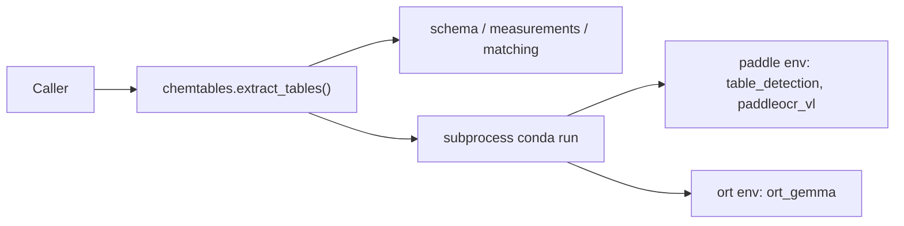

# chemtables

Extract bioactivity tables (compounds, targets, measurements) from PDF page
images: table detection, OCR, LLM-assisted schema interpretation, and
deterministic measurement parsing, wired together behind a small Python API.

The wrapper API itself has no GPU dependencies; the heavy lifting
(PaddleOCR-VL, an ONNX Gemma model) runs in isolated conda environments that
`chemtables` drives as subprocesses. This keeps `chemtables` easy to add as
an **optional** dependency to any project that only sometimes needs table
extraction — see [Using as an optional dependency](#using-as-an-optional-dependency)
below. It is used this way by [PDF2Chemicals](https://github.com/molmodcs/pdf2chemicals),
but `chemtables` has no knowledge of, or dependency on, that project.

## How it works



Everything to the right of `api` is a private implementation detail: no
conda, subprocess, worker, or model concept ever crosses the public API
boundary.

## Installation

`chemtables` itself is a thin wrapper (`pandas` + `pylatexenc`); the GPU
stacks live in two conda environments that the wrapper shells out to.

1. Install the package (editable, from a checkout):

   ```bash
   pip install -e .
   ```

   or as a git dependency:

   ```bash
   pip install "chemtables @ git+https://github.com/molmodcs/chemtables.git"
   ```

2. Create the two conda environments used by the workers:

   ```bash
   conda env create -f envs/environment.paddle.yml
   conda env create -f envs/environment.ort.yml
   ```

   Environment names default to `paddle` and `ort`; override via
   `TableExtractionConfig.paddle_env` / `.ort_env` or the
   `CHEMTABLES_PADDLE_ENV` / `CHEMTABLES_ORT_ENV` environment variables if
   you named them differently.

3. (Optional) Build the bio-entities catalog used for target/protein/cell-line
   matching:

   ```bash
   python scripts/build_bio_entities_db.py
   ```

   This reads `data/sources/uniprotkb_reviewed.tsv` and
   `data/sources/cellosaurus.txt` and writes `data/bio_entities.db`. Without
   it, target matching is silently disabled (measurement extraction still
   works, just without bound targets).

## Usage

```python
from chemtables import TableExtractionConfig, extract_tables

results = extract_tables(
    images=["images/table_chemical_6.png"],
    compound_refs=["1a", "2b"],
    output_dir="output",
)
for result in results:
    print(result.status, result.schema, result.measurements)
```

`extract_tables` runs table detection, PaddleOCR-VL extraction, LLM-assisted
schema interpretation, and deterministic measurement extraction, in that
order, over one or more same-directory PNG page images.

- `images`: paths to PNG images (must all live in the same directory).
- `compound_refs`: chemical coreference strings (e.g. compound IDs) used to
  locate the compound axis and bind measurements to compounds. When
  omitted, only detection + OCR run; every image comes back with status
  `"skipped"`.
- `output_dir`: root directory for per-image output subdirectories.
- `config`: optional `TableExtractionConfig` (see below).

Each result is a `TableResult`:

| field | type | meaning |
| --- | --- | --- |
| `image` | `Path` | input image path |
| `status` | `str` | `"ok"` / `"no_table"` / `"skipped"` / `"failed"` |
| `output_dir` | `Path` | per-image output directory |
| `schema` | `dict \| None` | interpreted table schema |
| `measurements` | `dict \| None` | extracted measurements |
| `error` | `str \| None` | failure reason, if any |

`TableExtractionConfig` carries the knobs that would otherwise leak
implementation details, all with working defaults:

```python
@dataclass
class TableExtractionConfig:
    paddle_env: str = "paddle"
    ort_env: str = "ort"
    conda: str = "conda"          # or $CONDA_EXE
    skip_existing: bool = False
    write_table_detection: bool = False
    bio_entities_db: str | Path | None = None
    verbose: bool = True
```

Use `environment_ready()` to check whether `conda` and the `paddle`/`ort`
environments are available, so a caller can degrade gracefully instead of
letting `extract_tables` raise partway through a run:

```python
from chemtables import environment_ready

if environment_ready():
    from chemtables import extract_tables
else:
    extract_tables = None
```

### Command line

```bash
python -m chemtables --input-dir images --output-dir output --compound-refs compound_refs.json
```

See `python -m chemtables --help` for the full flag list (`--skip-existing`,
`--bio-entities-db`, `--paddle-env`, `--ort-env`, `--conda`, ...).

## Using as an optional dependency

Since `chemtables` requires extra conda environments to do anything useful,
host projects typically declare it as an optional extra rather than a hard
dependency:

```toml
[project.optional-dependencies]
tables = ["chemtables @ git+https://github.com/molmodcs/chemtables.git"]
```

and import it defensively so the host project still works without it
installed:

```python
try:
    from chemtables import extract_tables
except ImportError:
    extract_tables = None
```

## Project layout

```
src/chemtables/
  api.py              public facade (extract_tables, TableExtractionConfig, TableResult, environment_ready)
  cli.py              argparse front-end over api.py
  pipeline.py         internal stage orchestration (detect -> OCR -> schema -> measurements)
  paths.py            package data + configurable bio_entities.db resolution
  gemma_client.py      subprocess client for the ort_gemma worker
  schema/             table schema interpretation
  measurements/       measurement parsing/extraction
  matching/           compound axis + bio-entity (target/protein/cell-line) matching
  workers/            code that runs inside the paddle/ort conda envs
  data/               packaged data (stopwords, bio_entities.sql schema)
envs/                 conda environment.paddle.yml / environment.ort.yml
data/                 bio_entities.db + sources/ (gitignored, built locally)
scripts/              build_bio_entities_db.py
tests/                pytest suite
samples/              example page images
```

## Development

```bash
pip install -e ".[dev]"
pytest
```

## License

AGPL-3.0-only, matching [pdf2chemicals](https://github.com/molmodcs/pdf2chemicals).
